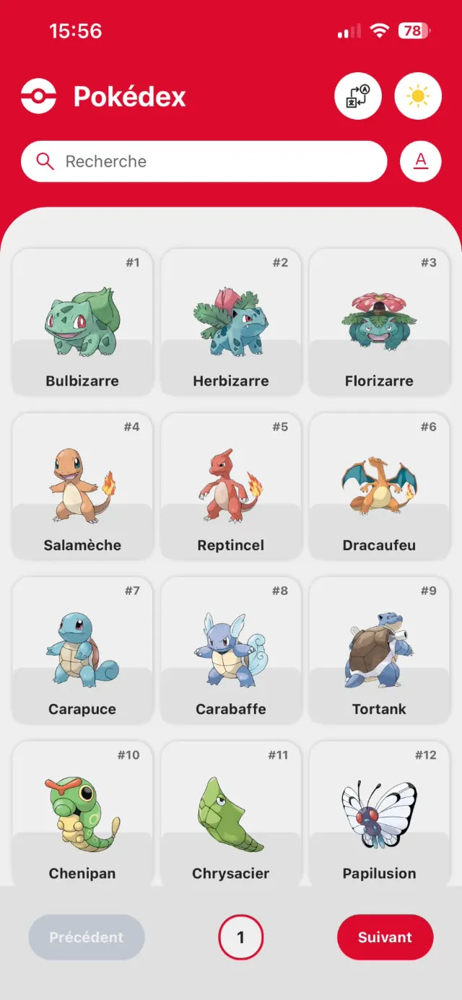
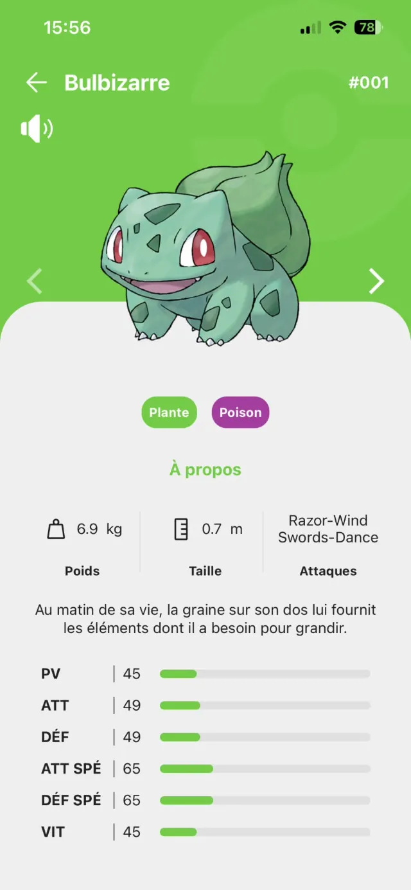
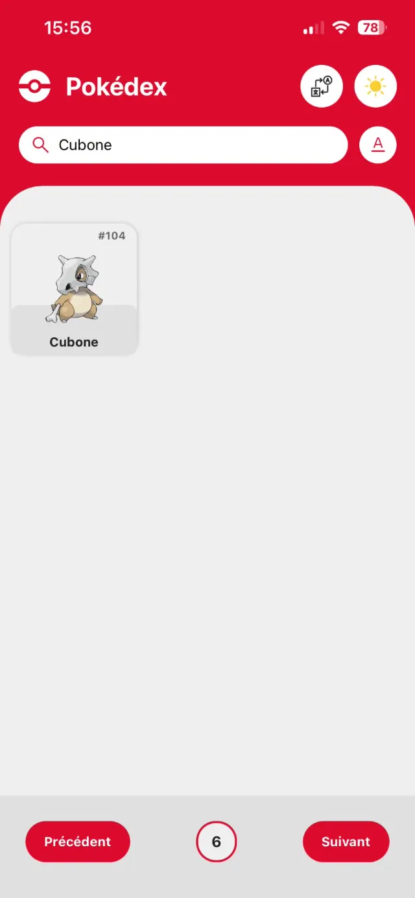
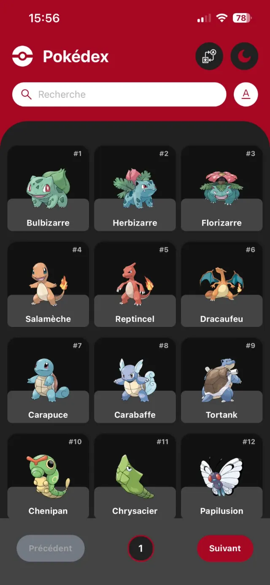
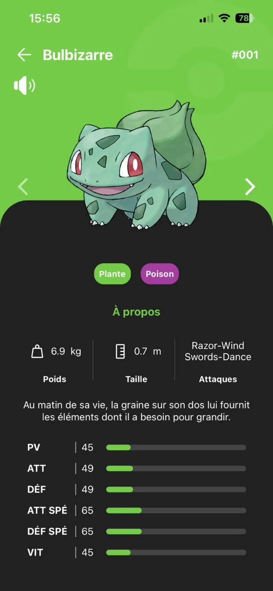

# Pokédex

🌐 **Languages:** [English](#english) · [Français](#français)

---

<a id="english"></a>

## 🇬🇧 English

A mobile Pokédex app built with React Native and Expo, using the PokéAPI as its data source.
The app lets you browse Pokémon, search for a Pokémon, view detailed information, switch language or theme, and listen to a Pokémon's cry.

### Screenshots

<p align="center">
  
  
  
</p>

<p align="center">
  
  
</p>

### Features

- Pokémon browsing with pagination
- Search by name
- Detail pages
- Pokémon names and descriptions in French and English
- Unit conversion
- Light and dark theme
- Colors adapted to Pokémon types
- Animations
- Playback of Pokémon cries
- VoiceOver and accessibility support
- Accessibility labels in French and English

### Technologies

- React Native
- Expo
- TypeScript
- Expo Router
- TanStack React Query
- NativeWind / Tailwind CSS
- React i18next
- React Native Reanimated
- Expo Audio
- PokéAPI

TypeScript is used to ensure reliable typing of the data and the app's components.

### Architecture

The app follows a simple separation between the interface, data fetching, and data transformation:

```text
Screen
  ↓
Hook
  ↓
React Query
  ↓
Service
  ↓
Mapper
  ↓
PokéAPI
```

Services handle calls to the PokéAPI, and mappers transform the received data into objects suited to the app.

### API

The main data comes from:

- `/pokemon` → list of Pokémon
- `/pokemon/{id}` → detailed data
- `/pokemon-species/{id}` → localized names and descriptions

### Internationalization

The app supports:

- 🇫🇷 French
- 🇬🇧 English

Interface texts, Pokémon names and descriptions, and accessibility information are adapted to the selected language.

### Accessibility

The app includes VoiceOver support with:

- Dynamic accessibility labels
- Accessible navigation
- Accessible information for stats
- French and English support

### Project structure

```text
app/
├── index.tsx
└── pokemon/
    └── [id].tsx

components/
├── layout/
├── pokemon/
└── ui/

hooks/
services/
mappers/
theme/
i18n/
svg/
types/
lib/
```

### Installation

Install dependencies:

```bash
npm install
```

Configure the environment by creating a `.env.local` file:

```env
EXPO_PUBLIC_API_URL=https://pokeapi.co/api/v2
```

Run the app:

```bash
npx expo start
```

The app can be run on a simulator, an emulator, or a physical device.

### Goal

This project was built to practice React Native, TypeScript, data management with React Query, internationalization, animations, audio, and mobile accessibility.

### License

Personal and educational project.

---

<a id="français"></a>

## 🇫🇷 Français

Une application mobile Pokédex développée avec React Native et Expo, utilisant la PokéAPI comme source de données.
L'application permet de parcourir les Pokémon, de rechercher un Pokémon, de consulter ses informations détaillées, de changer de langue ou de thème et d'écouter son cri.

### Captures d'écran

<p align="center">
  
  
  
</p>

<p align="center">
  
  
</p>

### Fonctionnalités

- Parcours des Pokémon avec pagination
- Recherche par nom
- Pages de détails
- Noms et descriptions en français et en anglais
- Conversion des unités de mesure
- Thème clair et sombre
- Couleurs adaptées aux types Pokémon
- Animations
- Lecture des cris des Pokémon
- Support de VoiceOver et de l'accessibilité
- Labels d'accessibilité en français et en anglais

### Technologies

- React Native
- Expo
- TypeScript
- Expo Router
- TanStack React Query
- NativeWind / Tailwind CSS
- React i18next
- React Native Reanimated
- Expo Audio
- PokéAPI

TypeScript est utilisé pour assurer un typage fiable des données et des différents composants de l'application.

### Architecture

L'application suit une séparation simple entre l'interface, la récupération et la transformation des données :

```text
Écran
  ↓
Hook
  ↓
React Query
  ↓
Service
  ↓
Mapper
  ↓
PokéAPI
```

Les services gèrent les appels à la PokéAPI et les mappers transforment les données reçues en objets adaptés à l'application.

### API

Les principales données utilisées proviennent de :

- `/pokemon` → liste des Pokémon
- `/pokemon/{id}` → données détaillées
- `/pokemon-species/{id}` → noms et descriptions localisés

### Internationalisation

L'application prend en charge :

- 🇫🇷 Français
- 🇬🇧 Anglais

Les textes de l'interface, les noms et descriptions des Pokémon ainsi que les informations d'accessibilité sont adaptés à la langue sélectionnée.

### Accessibilité

L'application intègre le support de VoiceOver avec :

- Labels d'accessibilité dynamiques
- Navigation accessible
- Informations accessibles pour les statistiques
- Support du français et de l'anglais

### Structure du projet

```text
app/
├── index.tsx
└── pokemon/
    └── [id].tsx

components/
├── layout/
├── pokemon/
└── ui/

hooks/
services/
mappers/
theme/
i18n/
svg/
types/
lib/
```

### Installation

Installer les dépendances :

```bash
npm install
```

Configurer l'environnement en créant un fichier `.env.local` :

```env
EXPO_PUBLIC_API_URL=https://pokeapi.co/api/v2
```

Lancer l'application :

```bash
npx expo start
```

L'application peut être lancée sur un simulateur, un émulateur ou un appareil physique.

### Objectif

Ce projet a été réalisé afin de mettre en pratique React Native, TypeScript, la gestion des données avec React Query, l'internationalisation, les animations, l'audio et l'accessibilité mobile.

### Licence

Projet réalisé à des fins personnelles et éducatives.
